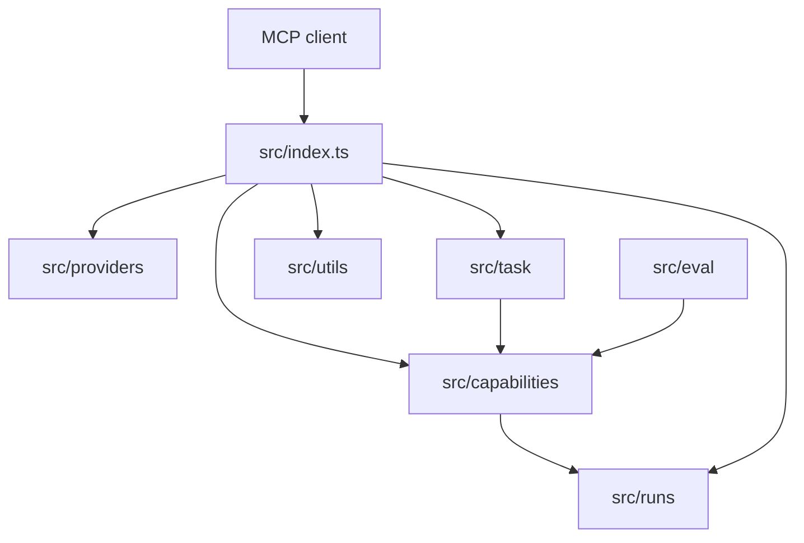

<!-- generated-by: gsd-doc-writer -->
# Architecture

## System Overview

Image Gen MCP is a TypeScript MCP server that exposes image generation, image processing, direct image capability invocation, and goal-based image task planning over MCP transports. The server accepts tool calls from MCP clients, routes them through provider adapters or local capability modules, writes image artifacts to the filesystem, and returns compact JSON metadata with paths rather than base64 payloads.

## Component Diagram



## Data Flow

1. `src/index.ts` creates an MCP server with `createServer()` and registers six tools with Zod schemas.
2. `generate_image` and `generate_asset` resolve a provider through the provider registry, invoke the provider adapter, then save the returned image buffer through `resolveOutputPath()` and `saveImage()`.
3. `process_image` reads a local image and applies deterministic sharp operations through `applyOperations()`.
4. `image_op` validates a requested `(op, provider)` pair against the capability registry, invokes the capability, writes run artifacts under `.runs/<runId>/`, and returns a trace.
5. `image_task` matches template fast paths or calls the Anthropic-backed planner, validates the DAG, executes capability nodes, and serializes a path-only response.
6. At process startup, `main()` selects stdio transport by default or SSE transport when `--sse` or `MCP_SSE_PORT` is set.

## Key Abstractions

| Abstraction | Location | Purpose |
|-------------|----------|---------|
| `createServer()` | `src/index.ts` | Builds a configured MCP server instance and registers tools. |
| `ProviderRegistry` | `src/providers/index.ts` | Tracks generation providers and provider capabilities such as size support. |
| `ImageProvider` | `src/providers/index.ts` | Shared interface implemented by OpenAI, Gemini, Replicate, Together, and Grok adapters. |
| `CapabilityRegistry` | `src/capabilities/registry.ts` | Stores registered `(op, provider)` capability implementations. |
| `Capability` | `src/capabilities/types.ts` | Defines operation metadata, constraints, cost, quality, and invoke function. |
| `Plan` | `src/task/plan-schema.ts` | Zod-backed shape for image task DAG plans. |
| `executeDag()` | `src/task/dag-executor.ts` | Executes validated capability DAG nodes and records node results. |
| `RunManifest` | `src/runs/manifest.ts` | Describes persisted run artifacts and node metadata. |
| `ProcessingOperation` | `src/utils/processing.ts` | Union of supported local processing operations. |
| `AssetPreset` | `src/utils/presets.ts` | Defines preset generation and processing pipelines for ready-made assets. |

## Directory Structure Rationale

```text
src/
  capabilities/  Operation-level image capabilities used by image_op and image_task.
  eval/          Provider-quality evaluation fixtures, scorers, and result application.
  providers/     Text-to-image provider adapters and the provider registry.
  runs/          Run IDs, trace nodes, manifests, artifact paths, and retention cleanup.
  task/          image_task templates, planning, validation, DAG execution, and response guards.
  utils/         Shared image output, processing, OCR, input-root, and preset helpers.
tests/
  capabilities/  Unit tests for individual capability implementations.
  integration/   MCP tool integration tests for image_op, image_task, and list_capabilities.
  task/          Planner, DAG, schema, validation, and serialization tests.
  utils/         Utility tests.
  eval/          Evaluation harness tests.
scripts/
  check-models.ts  Provider model discovery report.
  run-eval.ts      Evaluation runner entry point.
eval/
  cases/       JSON eval case definitions.
  fixtures/    Shared eval fixture manifest and assets.
docs/
  Project documentation and planning notes.
```
